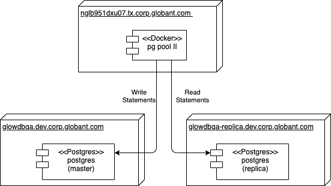

# PG-POOL II POC for Glow Database

## Introduction and motivation (Abstract!)

The Glow database serves the world-wide web application, *Glow*, present mainly in three different geographic locations
: Argentina, Buenos Aires (LATAM), India, Pune, and Unite States, San Francisco. The three databases are
 synchronized but only the master database located on LATAM accepts read and write statements, while the replicas
  accepts only read statements. 
  
This architecture represents a challenge in order to send SQL statements to the right server, and it has been solved
 at a design level redirecting the actions to Java components that are configured accordingly to the database to
  which they are linked.   

This POC (_proof of concept_) aims to try [PG-POOL II](http://pgpool.net/) as a Database SQL load balancer component
 that forwards SQL writes, like `INSERT`, `UPDATE`, `DELETE` SQL sentences to the master data
  base node, while SQL reads, like `SELECT` statements are forwarded to a standby node, in a transparent fashion
  , without the software layer to be aware of this particular database architecture. This moves the responsability of
   the redirection from the software layer, to the component architecture level.
  
     
## Architecture

The POC will consist in a PG-POOL II server configured to redirect all `READ` statements to the replica database
, while the 'WRITE' statements to the master node.

Instead of installing PG-POOL II directly onto a server, we are going to use a [docker](https:www.docker.com) 
container using the [Bitnami](https://github.com/bitnami/bitnami-docker-pgpool) docker image. 

The following _UML deployment diagram_ summarizes this configuration:

TODO


### Servers

The back-end servers used on this POC are:
  + *Master DB*. This is the primary database, used to write data.
     + namer server: *glowdbqa.dev.corp.globant.com*, port 5432.
  + *Replica1*
     + namer server: *ngl0038qxu05.tx.corp.globant.com*, port 5432. 
  + *Replica2*
     + namer server: *glowdbqa-replica.dev.corp.globant.com*, port 5432.
    
The POC credentials for these databases are: `pgpool_user`:`pg_1234`.    

## Configuration

PG-POOL II is deployed with most of its default configuration. This default configuration is declared on the file
 [`pgpool.conf`](../resources/pgpool.conf) In
 order to alter this configuration, embedded on the
 docker container, an aditional configuration file is to be added. Furthermore, credentials for users allowed to go
  through PG-POOL are also store on a file mapped to the container file system.
  
### Docker file

The [Bitnami](https://github.com/bitnami/bitnami-docker-pgpool) docker image is started with the following [script
](bitnami%20glowdbqa/pgpool-docker.sh):

```script
docker run -p 5432:5432 -d --rm --name pg-pool \
    --env PGPOOL_BACKEND_NODES=0:glowdbqa.dev.corp.globant.com:5432,1:glowdbqa-replica.dev.corp.globant.com:5432 \
    --env PGPOOL_SR_CHECK_USER=pgpool_user \
    --env PGPOOL_SR_CHECK_PASSWORD=pg_1234 \
    --env PGPOOL_ENABLE_LDAP=no \
    --env PGPOOL_POSTGRES_USERNAME=pgpool_user \
    --env PGPOOL_POSTGRES_PASSWORD=pg_1234 \
    --env PGPOOL_ADMIN_USERNAME=admin \
    --env PGPOOL_ADMIN_PASSWORD=adminpassword \
    --env PGPOOL_USER_CONF_FILE=/config/myconf.conf \
    --env PGPOOL_PASSWD_FILE=/config/pool_passwd \
    --volume /root/pgpool/config/pgpool-ext.conf:/config/myconf.conf \
    --volume /root/pgpool/config/pgpasswd:/config/pool_passwd \
    bitnami/pgpool:latest
```
The image container is named `pg-pool` and the pg-pool port `5432` is exported to the local machine port `5432`:
  * `PGPOOL_BACKEND_NODES` define the list of all databases, which are refered as *backend nodes*. This list includes
   de master and standby nodes, which are to be synchronized. 
  * `PGPOOL_SR_CHECK_USER` declares a user that can query the backend databases in order to balance them. 
  * `PGPOOL_SR_CHECK_PASSWORD` declares the password for the checking user. 
  * `PGPOOL_ENABLE_LDAP` states that no LDAP is used for credentials. 
  * `PGPOOL_POSTGRES_USERNAME` the user used to connect to the databases. 
  * `PGPOOL_POSTGRES_PASSWORD` the user's password. 
  * `PGPOOL_ADMIN_USERNAME` declares the PG-POOL II administration user. 
  * `PGPOOL_ADMIN_PASSWORD` declares the PG-POOL II administration user's password. 
  * `PGPOOL_USER_CONF_FILE` declares the container's relative path to a file containing pg-pool configuration options. 
  * `PGPOOL_PASSWD_FILE` declares the container's relative path to a file containing credentials in the form `user
  :password` that are allowed to pass through pg-pool. 

The reader can notice there are two _docker volume_ mappings:
  * `/config/myconf.conf`. This maps the internal configuration file that PGPOOL is going to read.
  * `/config/pool_passwd`. This maps the internal password files.

### PG-POOL II Configuration properties

PG-POOL II has a configuration properties that can be used to set many options. While inside of the docker container
, these properties cannot be directly overwritten, and the way to specify preferences is to add them to a
 configuration file and linked to the container using the `--volume` docker option.
 
 The properties that have been re-defined on the file [pgpool-ext.conf](bitnami%20glowdbqa/pgpool-ext.conf) are:
   - `allow_clear_text_frontend_auth` with value `on`. Allows SQL clients to send credentials as plain text.
   - `log_per_node_statement` with value `on`, defines that statements received by PG-POOL II are also sent to the
    log output.
   - `backend_weight0` with value `0` states that `READ` requests will **not** be forwarded to backend node with ID
    `0`. 
   - `backend_weight1` with value `1000` states that `READ` requests **will be** forwarded to backend node with ID `1` with a ratio weigh of `1000`.
   - `database_redirect_preference_list` will also help to define the balance ratio for `READ` statements. The
    given quoted value `glowsimilprod:1(1.0)` states that `READ` requests directed to database `glowsimilprod` will
     have a ratio for backend node `ID 1` of 100%, whenever it is possible.
   - `load_balance_mode` with value `on` states that load balancing is active.